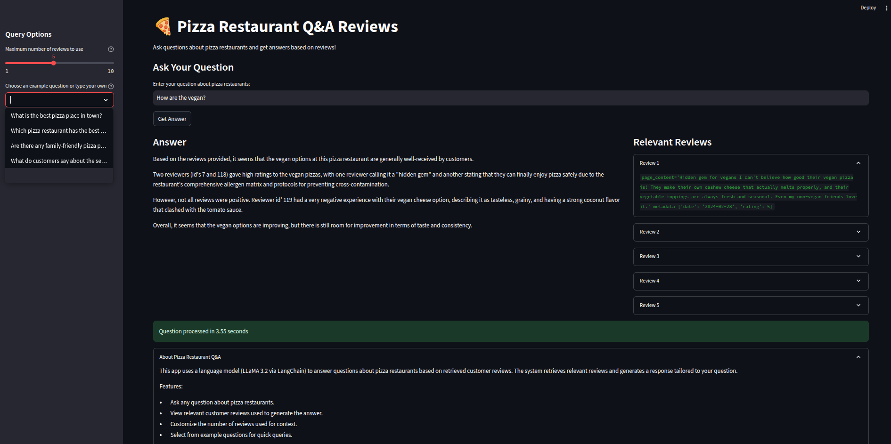

# Local RAG Based AI Agent




## Overview

This app uses a language model (LLaMA 3.2 via LangChain) to answer questions about pizza restaurants based on retrieved customer reviews. The system retrieves relevant reviews and generates a response tailored to your question.

## Features:

- Ask any question about pizza restaurants.
- View relevant customer reviews used to generate the answer.
- Customize the number of reviews used for context.
- Select from example questions for quick queries.

## Installation

### Prerequisites

- **Python 3.10 or higher**: [Download Python](https://www.python.org/downloads/)
- **OpenAI Hugging Face Token Access**: [Sign up for Hugginf Face's Token](https://huggingface.co/)

### Steps

1. **Clone the Repository**

   ```bash
   git clone https://github.com/rezwanh001/LocalRAGAIAgent
   cd LocalRAGAIAgent
   ```

2. **Create a Virtual Environment**

   ```bash
   conda activate <your env name>
   ```

3. **Install Dependencies**

   ```bash
   pip install -r requirements.txt
   ```

4. **Set Up Environment Variables**

   Create a `.env` file in the project root:

   ```dotenv
   HF_TOKEN="Your Hugging Face Token"
   ```

## Usage

1. **Activate the Virtual Environment**

   ```bash
   conda activate <your env name>
   ```

2. **Run the Streamlit App**

   ```bash
   streamlit run app.py
   ```

3. **Access the App**

   Open the URL provided by Streamlit (usually `http://localhost:8501`) in your web browser.


## Acknowledgements

- [Streamlit](https://streamlit.io/) for the web application framework.
- [AIAnytime](https://github.com/AIAnytime/AI-Agents-from-Scratch-using-Ollama) for the stremlit design.
- [LocalAIAgentWithRAG](https://github.com/techwithtim/LocalAIAgentWithRAG/tree/main) for csv file and core code.